# Oral History Metadata Generation Tool

New updates to the automated metadata generation pipeline are here. This tool is now generalizable for all oral history interviews.

https://interviewmetadata.onrender.com/

# How to Use

    1. Upload an interview in srt format, or use the provided interview of Amos C Brown.
    2. Obtain an OpenAI API key or find a provider for free API keys with limited usage.
    3. Adjust any hyperparameters before each generation step
    4. Let the tool generate metadata automatically
    5. Review the generated metadata and make any needed changes to prompts or other parameters.
    6. Export the final JSON, containing the interview metadata for use in your workflow.

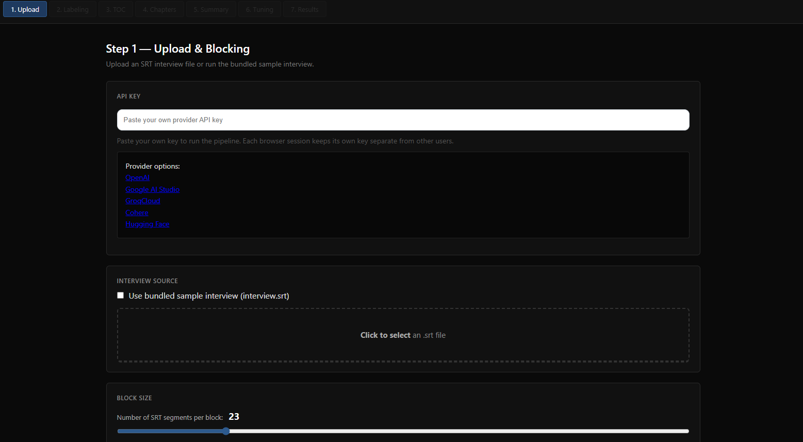

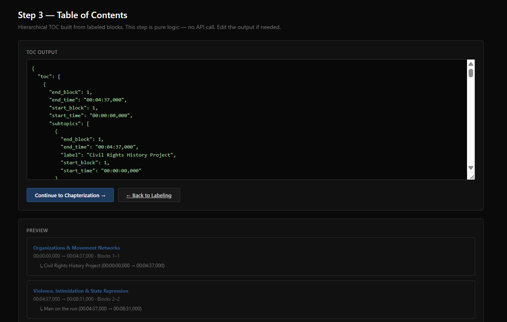

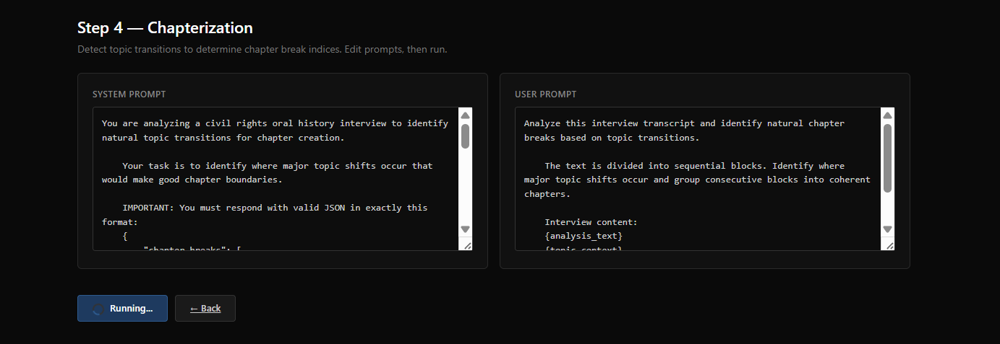

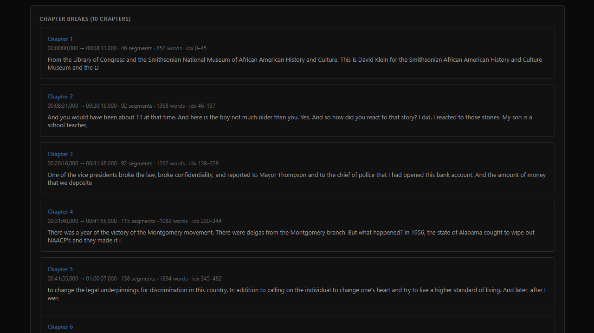

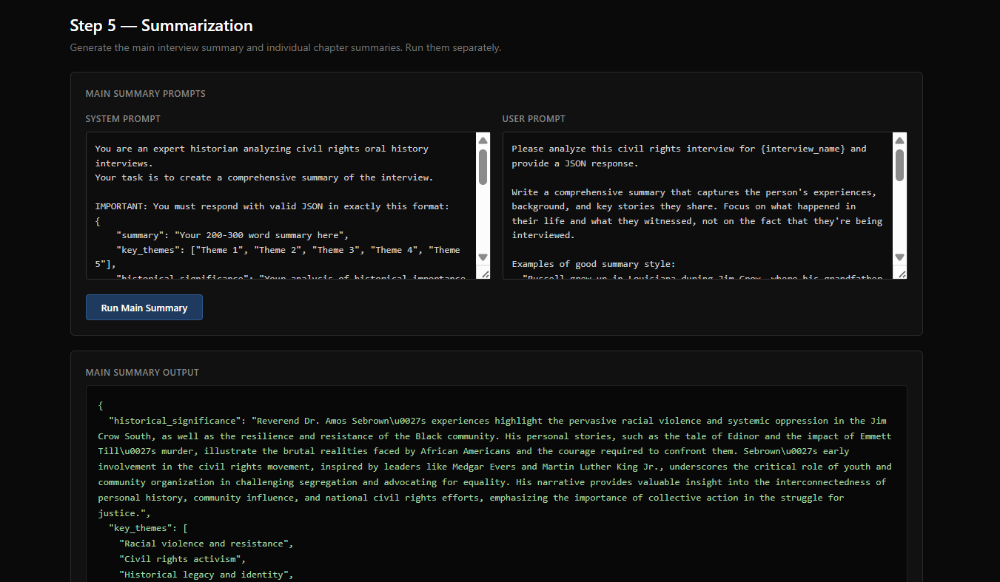

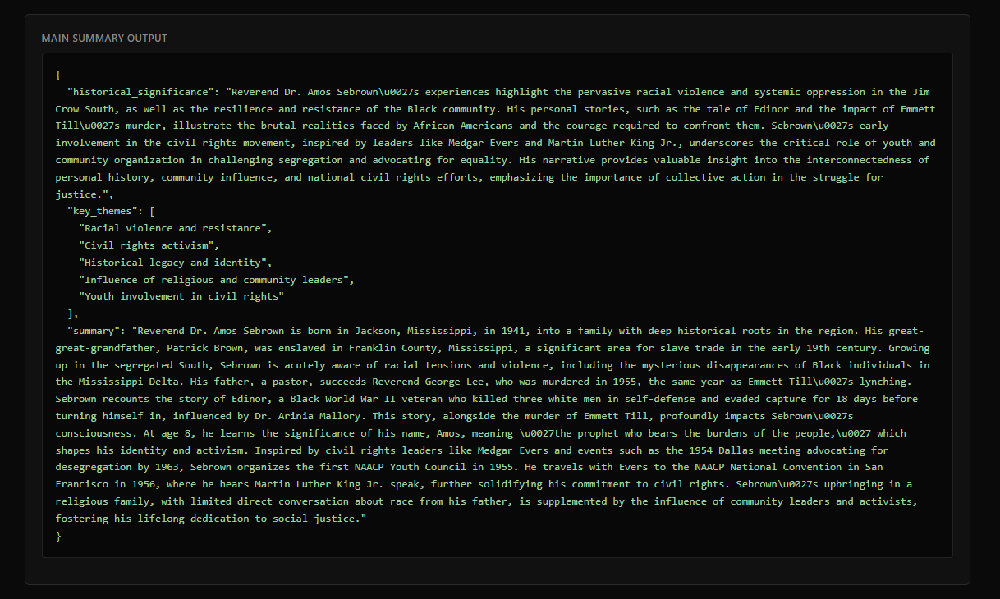

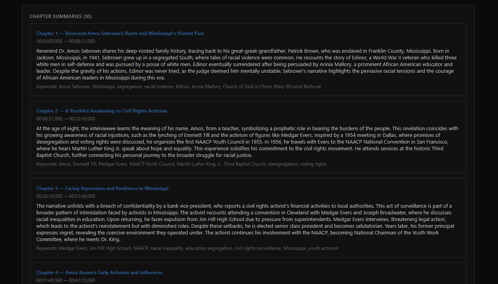

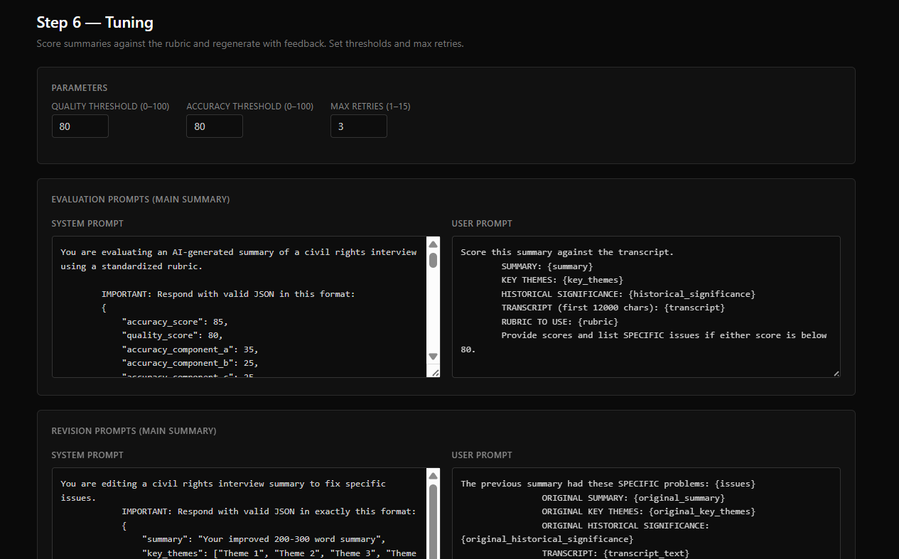

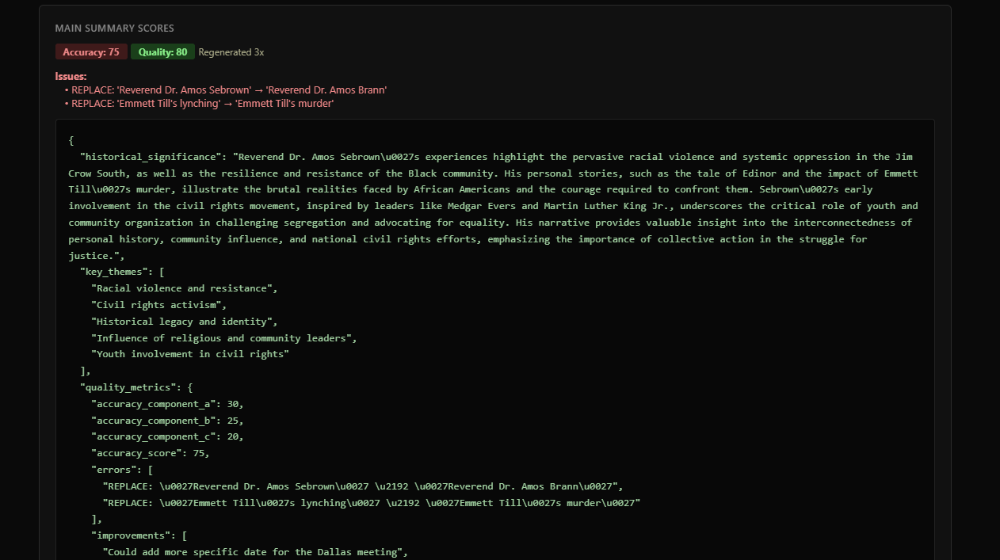

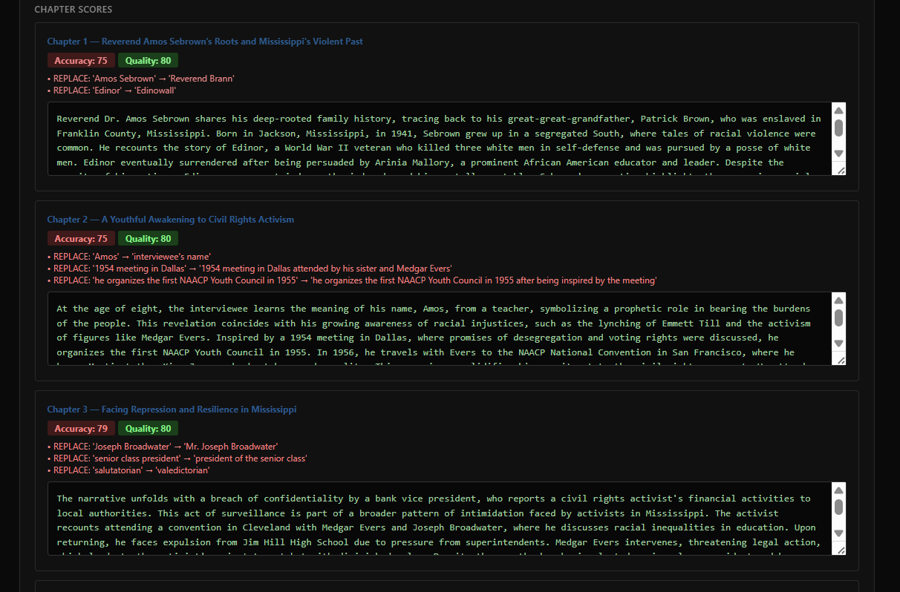

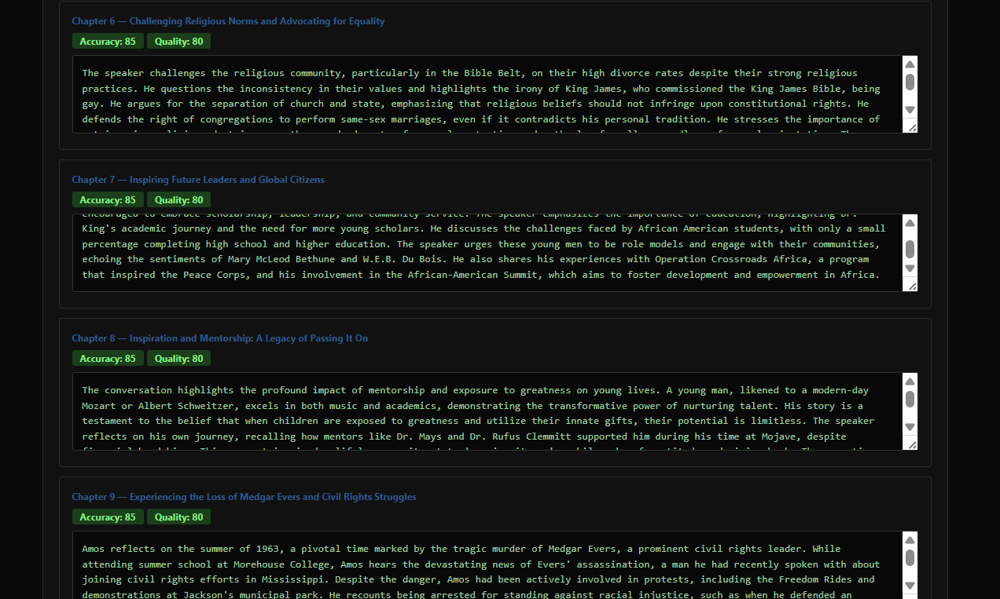

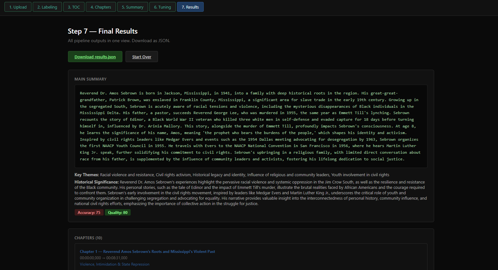