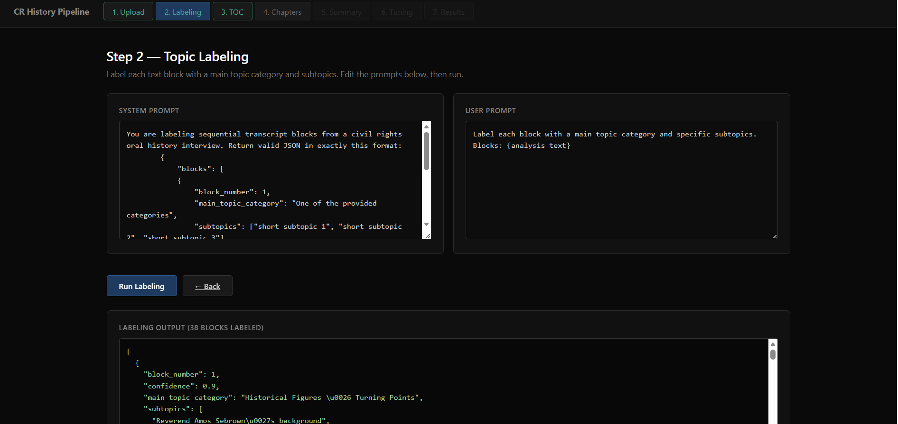

# Oral History Metadata Generation Tool

New updates to the automated metadata generation pipeline are here. This tool is now generalizable for all oral history interviews.

https://interviewmetadata.onrender.com/

